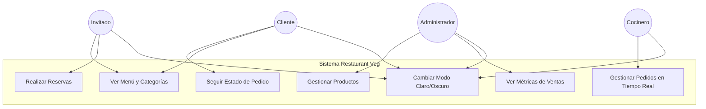

# 🥗 Restaurant Veg - Sistema de Gestión Gastronómica

Este proyecto es una aplicación web premium para un restaurante que combina cocina vegetariana y parrilla, desarrollada con una arquitectura escalable y moderna.

---

## 🏗️ Arquitectura Frontend: Domain-Driven Frontend (DDF)

El proyecto sigue la metodología **DDF**, que organiza el código por dominios de negocio en lugar de tipos técnicos. Esto permite un desacoplamiento total entre las diferentes áreas del sistema.

### Estructura de Directorios
```text
src/
├── app/
│   ├── (site)/           # Dominio Público (Invitados)
│   ├── (panel)/          # Dominio Cliente (Autenticado)
│   ├── (paneladmin)/     # Dominio Administrativo (Gestión)
│   ├── (panelkitchen)/   # Dominio Cocina (Operativo)
│   └── login/            # Autenticación Centralizada
├── components/           # Shared Layer: UI Reutilizable Global
├── lib/                  # Shared Layer: Helpers y Utilidades
└── styles/               # Tokens de diseño y Tailwind Config
```

---

## 🎭 Roles y Casos de Uso

### Diagrama de Casos de Uso (Esquema)



### Detalle de Funcionalidades por Rol

#### 1. 🌐 Invitado (No registrado)
*   **Acceso**: Landing page pública.
*   **Funcionalidad**: 
    *   Visualización de platos destacados.
    *   Navegación por categorías (Vegetariano / Parrilla).
    *   Acceso a información de contacto y ubicación.
    *   Acceso al flujo de inicio de sesión.

#### 2. 👤 Cliente (Registrado)
*   **Acceso**: Panel de Cliente Personalizado.
*   **Funcionalidad**: 
    *   **Dashboard**: Resumen de pedidos totales, puntos acumulados y ahorro mensual.
    *   **Pedidos**: Seguimiento del estado (En cocina, listo, entregado).
    *   **Favoritos**: Acceso rápido a platos pedidos frecuentemente.

#### 3. 🧑‍🍳 Cocinero (Operativo)
*   **Acceso**: Panel de Cocina de alta visibilidad.
*   **Funcionalidad**: 
    *   **Tablero de Pedidos**: Recepción de comandas en tiempo real.
    *   **Priorización**: Marcado visual de pedidos urgentes.
    *   **Gestión de Estados**: Cambio de estado de platos a "LISTO" con un solo clic.

#### 4. 🛠️ Administrador (Gestión SaaS)
*   **Acceso**: Panel Administrativo Avanzado.
*   **Funcionalidad**: 
    *   **Métricas**: Ingresos del día, tasa de nuevos clientes y platos más vendidos.
    *   **Gestión**: Control total sobre el catálogo de productos y usuarios.
    *   **Reportes**: Exportación de datos para análisis financiero.

---

## 🎨 Stack Tecnológico

*   **Framework**: [Next.js 15+](https://nextjs.org/) (App Router).
*   **Estilos**: [Tailwind CSS 4.0](https://tailwindcss.com/) (Utility-first).
*   **Iconografía**: [Lucide React](https://lucide.dev/).
*   **Temas**: [Next-Themes](https://github.com/pacocoursey/next-themes) (Soporte nativo para Modo Claro/Oscuro).
*   **Tipografía**: Geist Sans & Geist Mono (Vercel).

---

## 🌓 Soporte de Temas

El sistema implementa una estrategia de **Modo Claro** y **Modo Oscuro** global:
- **Modo Claro**: Fondo `white` / `zinc-50`, texto `zinc-900`.
- **Modo Oscuro**: Fondo `zinc-950`, texto `zinc-50`.
- **Configuración**: El sistema detecta automáticamente la preferencia del sistema operativo, pero permite el cambio manual mediante el componente `ThemeToggle` presente en todos los paneles.

---

## 🚀 Desarrollo

Este proyecto utiliza **pnpm** como gestor de paquetes y está organizado como un monorepo (Frontend & Backend).

Para iniciar el proyecto en entorno local:

```bash
# Instalar dependencias
pnpm install

# Iniciar todos los servicios (Frontend y Backend) en paralelo
pnpm dev
```

### Otros Comandos Útiles

```bash
# Construir todos los proyectos
pnpm build

# Iniciar en modo producción
pnpm start
```
