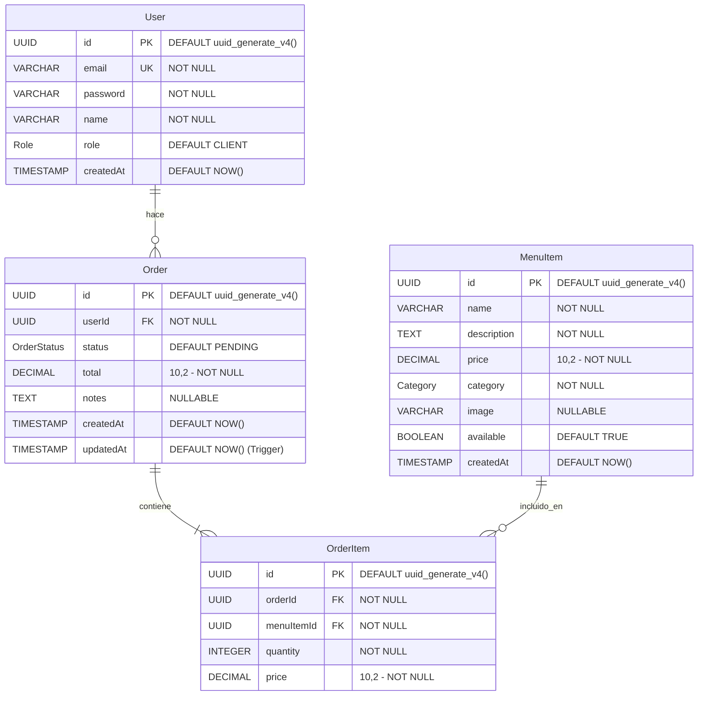
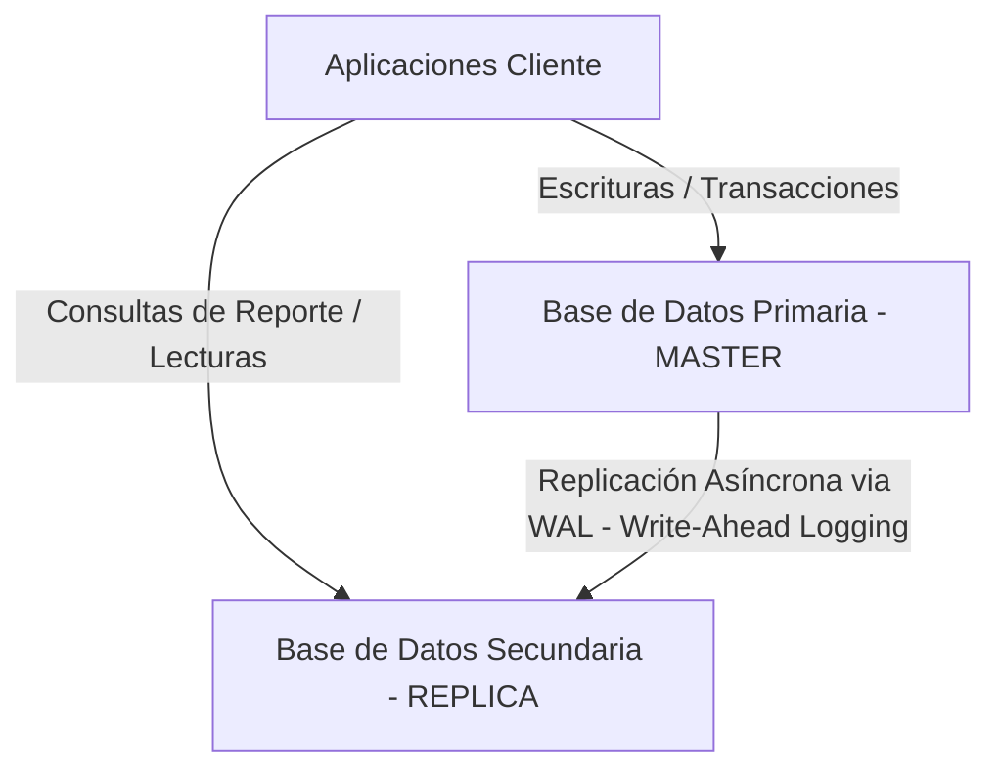

# Entregable 1: Integración, Administración y Diseño Físico de Base de Datos
**Curso: Proyectos Universitarios**  
**Proyecto: Restaurante Vegetariano (RESTVEG_BD)**  
**Estudiante: Marx Alonso**  
**Rúbrica Evaluada: Integración con Base de Datos (4 Puntos)**

---

## 1. Diseño Físico de Base de Datos y Diccionario
La base de datos **RESTVEG_BD** ha sido diseñada físicamente en **PostgreSQL**, garantizando una estructuración idónea para la persistencia, integridad referencial y velocidad de consulta. A continuación se presenta el Modelo Físico Relacional.

### 1.1. Diagrama Entidad-Relación (Físico)



### 1.2. Diccionario de Datos Físico

#### Tabla 1: `User` (Usuarios y Roles)
Guarda la información de clientes, administradores y personal de cocina.
| Nombre de Columna | Tipo de Datos Físico | Restricciones | Descripción / Comportamiento |
| :--- | :--- | :--- | :--- |
| `id` | `UUID` | `PRIMARY KEY`, `DEFAULT uuid_generate_v4()` | Identificador único de usuario generado de forma segura. |
| `email` | `VARCHAR(255)` | `UNIQUE`, `NOT NULL` | Correo electrónico institucional o personal para acceso. |
| `password` | `VARCHAR(255)` | `NOT NULL` | Hash seguro e irreversible de la contraseña generado con BCrypt. |
| `name` | `VARCHAR(255)` | `NOT NULL` | Nombre completo del usuario. |
| `role` | `Role` (ENUM) | `NOT NULL`, `DEFAULT 'CLIENT'` | Rol del usuario. Valores: `CLIENT`, `ADMIN`, `KITCHEN`. |
| `createdAt` | `TIMESTAMP` | `NOT NULL`, `DEFAULT NOW()` | Registro cronológico del alta del usuario. |

#### Tabla 2: `MenuItem` (Platos y Bebidas)
Contiene la oferta gastronómica vegetariana del restaurante.
| Nombre de Columna | Tipo de Datos Físico | Restricciones | Descripción / Comportamiento |
| :--- | :--- | :--- | :--- |
| `id` | `UUID` | `PRIMARY KEY`, `DEFAULT uuid_generate_v4()` | Identificador del ítem del menú. |
| `name` | `VARCHAR(255)` | `NOT NULL` | Nombre del platillo (ej. Lomo Saltado Veggie). |
| `description` | `TEXT` | `NOT NULL` | Detalle e ingredientes del platillo. |
| `price` | `DECIMAL(10,2)` | `NOT NULL` | Precio de venta en moneda nacional. |
| `category` | `Category` (ENUM) | `NOT NULL` | Categorías: `APPETIZER`, `MAIN`, `DESSERT`, `DRINK`. |
| `image` | `VARCHAR(255)` | `NULLABLE` | Nombre de archivo o URL de la imagen del platillo. |
| `available` | `BOOLEAN` | `NOT NULL`, `DEFAULT TRUE` | Control de stock lógico para ver si el plato está disponible. |
| `createdAt` | `TIMESTAMP` | `NOT NULL`, `DEFAULT NOW()` | Registro de fecha de creación del ítem. |

#### Tabla 3: `Order` (Cabecera de Pedidos)
Agrupa las órdenes que emiten los clientes.
| Nombre de Columna | Tipo de Datos Físico | Restricciones | Descripción / Comportamiento |
| :--- | :--- | :--- | :--- |
| `id` | `UUID` | `PRIMARY KEY`, `DEFAULT uuid_generate_v4()` | Código identificador del pedido. |
| `userId` | `UUID` | `FOREIGN KEY` (User), `NOT NULL` | Relación con el cliente que realiza el pedido. Borrado en cascada. |
| `status` | `OrderStatus` (ENUM)| `NOT NULL`, `DEFAULT 'PENDING'` | Estado del pedido: `PENDING`, `PREPARING`, `READY`, `COMPLETED`, `CANCELLED`. |
| `total` | `DECIMAL(10,2)` | `NOT NULL` | Monto total acumulado del pedido. |
| `notes` | `TEXT` | `NULLABLE` | Instrucciones especiales (ej. sin cebolla). |
| `createdAt` | `TIMESTAMP` | `NOT NULL`, `DEFAULT NOW()` | Fecha y hora en la que se generó la compra. |
| `updatedAt` | `TIMESTAMP` | `NOT NULL`, `DEFAULT NOW()` | Actualizada dinámicamente mediante trigger en actualización de estado. |

#### Tabla 4: `OrderItem` (Detalle de Pedidos)
Desglosa los platos seleccionados en cada orden.
| Nombre de Columna | Tipo de Datos Físico | Restricciones | Descripción / Comportamiento |
| :--- | :--- | :--- | :--- |
| `id` | `UUID` | `PRIMARY KEY`, `DEFAULT uuid_generate_v4()` | Código identificador del registro. |
| `orderId` | `UUID` | `FOREIGN KEY` (Order), `NOT NULL` | Asociación al pedido principal. Borrado en cascada. |
| `menuItemId` | `UUID` | `FOREIGN KEY` (MenuItem), `NOT NULL` | Asociación al plato o bebida. Restringe borrado si está ordenado. |
| `quantity` | `INTEGER` | `NOT NULL` | Cantidad de platos solicitados. |
| `price` | `DECIMAL(10,2)` | `NOT NULL` | Precio histórico al momento de realizar la compra. |

---

## 2. Consistencia 100% entre schema.prisma y Script SQL DDL
Existe una **consistencia absoluta** y bidireccional entre la definición lógica en ORM y la física del servidor PostgreSQL.

* **Tipos de Datos y Mapeos**:
  * Los tipos lógicos `String` con atributo `@id` y `@default(uuid())` en Prisma se corresponden directamente con el tipo físico `UUID` de PostgreSQL con `DEFAULT uuid_generate_v4()`.
  * Los campos con `@db.Decimal(10, 2)` mapean perfectamente con `DECIMAL(10, 2)`.
  * Los `Enum` de Prisma (`Role`, `Category`, `OrderStatus`) se crearon físicamente como `CREATE TYPE ... AS ENUM` en PostgreSQL.
* **Integridad y Relaciones**:
  * La relación `userId String` en Prisma con `@relation(fields: [userId], references: [id])` se implementa en SQL como un `FOREIGN KEY ("userId") REFERENCES "User"("id") ON DELETE CASCADE`.
  * Se configuraron índices físicos específicos (`idx_user_email`, `idx_order_user`, `idx_order_status`, etc.) que aceleran el rendimiento de las búsquedas implementadas por Prisma en backend.
* **Comportamiento Dinámico (`@updatedAt`)**:
  * Dado que PostgreSQL no posee de forma nativa un modificador `@updatedAt` como Prisma, se implementó en el archivo [database.sql](file:///c:/developer-marx/Proyectos%20Universitarios/Proyecto%20Restaurante%20Vegetariano/docs/v2/database.sql) un **Trigger de base de datos** (`update_order_updated_at`) que ejecuta la función `update_updated_at_column()` cada vez que se actualiza una fila en la tabla `Order`, manteniendo la consistencia de datos incluso si se editan filas directamente desde fuera de la aplicación (ej. pgAdmin 4).

---

## 3. Implementación del Patrón de Acceso a Datos (Repository Pattern)
En cumplimiento con la **Arquitectura Hexagonal**, el backend está estructurado con el **Patrón Repositorio**, aislando por completo el acceso a la base de datos (tecnología externa) de las reglas de negocio globales.

### Flujo de Abstracción en el Código
1.  **Dominio (Puerto - Entrada/Salida)**: En `domain/repositories/` se definen las interfaces abstractas que dictan el comportamiento esperado sin importar la base de datos (PostgreSQL, MongoDB o Memoria).
2.  **Infraestructura (Adaptador - Implementación)**: En `infrastructure/persistence/` se crea el repositorio concreto que interactúa con Prisma Client.

### Evidencia de Código de la Implementación
Tomemos como ejemplo el módulo de **Usuarios** (`users`):

#### 1. Definición del Puerto en el Dominio (`domain/repositories/users.repository.ts`)
*Define la firma del método sin depender de ninguna librería de base de datos:*
```typescript
import { User } from '../../domain/entities/user.entity.js';

export interface UserRepository {
  findById(id: string): Promise<User | null>;
  findByEmail(email: string): Promise<User | null>;
  create(user: Omit<User, 'id' | 'createdAt'>): Promise<User>;
}
```

#### 2. Implementación del Adaptador en Infraestructura (`infrastructure/persistence/prisma.user.repository.ts`)
*Usa Prisma Client para resolver físicamente la query contra la base de datos PostgreSQL:*
```typescript
import { PrismaClient } from '@prisma/client';
import { UserRepository } from '../../domain/repositories/users.repository.js';
import { User } from '../../domain/entities/user.entity.js';

export class PrismaUserRepository implements UserRepository {
  constructor(private prisma: PrismaClient) {}

  async findById(id: string): Promise<User | null> {
    const user = await this.prisma.user.findUnique({ where: { id } });
    if (!user) return null;
    return { ...user, role: user.role as any };
  }

  async findByEmail(email: string): Promise<User | null> {
    const user = await this.prisma.user.findUnique({ where: { email } });
    if (!user) return null;
    return { ...user, role: user.role as any };
  }

  async create(user: Omit<User, 'id' | 'createdAt'>): Promise<User> {
    const created = await this.prisma.user.create({
      data: {
        email: user.email,
        password: user.password,
        name: user.name,
        role: user.role as any,
      },
    });
    return { ...created, role: created.role as any };
  }
}
```

---

## 4. Informe de Administración y Replicación de Base de Datos
Para un sistema transaccional como el de nuestro restaurante vegetariano, garantizar la alta disponibilidad, escalabilidad y seguridad de la base de datos es indispensable.

### 4.1. Administración de Base de Datos (pgAdmin 4 y Studio)
*   **pgAdmin 4**: Se utiliza localmente como consola principal para auditar índices, analizar planes de ejecución (`EXPLAIN ANALYZE`) y diagnosticar cuellos de botella en las consultas SQL.
*   **Prisma Studio**: Herramienta de interfaz visual ligera y ágil que se levanta de forma segura para labores rápidas de depuración de datos sin riesgo de modificar DDL accidentales.
*   **Políticas de Backup (Copias de Seguridad)**:
    Se propone un script automatizado diario de respaldo ejecutado mediante `cron` o programador de tareas usando `pg_dump`:
    ```bash
    pg_dump -U postgres -h localhost -d RESTVEG_BD -F c -b -v -f "/backups/restveg_bd_$(date +%F).backup"
    ```
    Los backups se guardan en caliente (sin detener el servicio) en un servidor de almacenamiento seguro externo (ej. AWS S3) con retención de 30 días.

### 4.2. Diseño de Replicación de Base de Datos (Alta Disponibilidad)
Para garantizar la continuidad operativa y rendimiento del sistema en producción (evitando que consultas pesadas de analítica degraden el servicio del cliente al pedir), se ha diseñado una arquitectura de **Replicación por Streaming**:



*   **Servidor Maestro (Master)**: Procesa todas las operaciones de escritura (`INSERT`, `UPDATE`, `DELETE`) de los pedidos y usuarios. Registra las transacciones en los archivos **Write-Ahead Logging (WAL)**.
*   **Servidor Réplica (Read-Replica)**: Servidor en modo `Hot Standby` que aplica continuamente los cambios del WAL transmitidos desde el maestro de manera asíncrona (Streaming Replication). Este servidor atiende las peticiones de lectura pesadas (como estadísticas del dashboard de administración e historial de cocina), logrando un balanceo de carga eficiente y previniendo la degradación del servicio transaccional principal.
*   **Failover (Tolerancia a Fallos)**: Si el Maestro falla, un software de monitoreo (como `Patroni` o `pg_auto_failover`) promueve automáticamente a la Réplica como el nuevo Maestro en segundos, redirigiendo el tráfico del backend sin pérdida de datos.
