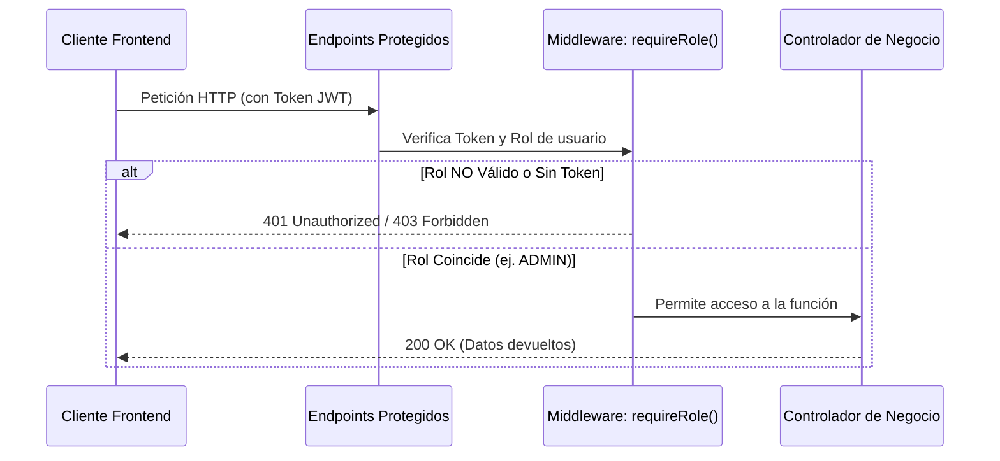

# Entregable 2: Módulo de Seguridad, Cifrado de Datos y Controles
**Curso: Proyectos Universitarios**  
**Proyecto: Restaurante Vegetariano (RESTVEG_BD)**  
**Estudiante: Marx Alonso**  
**Rúbrica Evaluada: Medidas de Seguridad Pertinentes (4 Puntos)**

---

## 1. Módulo de Autenticación y Autorización Implementado
El sistema posee un robusto esquema de **Autenticación Basada en Tokens JWT** (JSON Web Tokens) y **Autorización Basada en Roles** (RBAC - Role-Based Access Control) que regula de forma estricta los privilegios de los usuarios.

### 1.1. Proceso de Autenticación
1.  **Registro Seguro**: El usuario se registra enviando `email`, `password` y `name`. El backend en `auth.service.ts` recibe los datos y fuerza a que el rol asignado sea estrictamente `'CLIENT'`, neutralizando cualquier intento malicioso de registrarse directamente con privilegios elevados (`ADMIN` o `KITCHEN`). Las contraseñas de trabajadores adicionales son gestionadas únicamente por un administrador autenticado a través de la ruta protegida `/api/users/worker`.
2.  **Cifrado Hash de Contraseñas**: La contraseña plana nunca se almacena en la base de datos. Se encripta con un algoritmo unidireccional **BCryptJS** aplicando una semilla de 10 rondas de salado (`bcrypt.hash(password, 10)`).
3.  **Generación de Token JWT**: Al iniciar sesión con éxito, se genera un token cifrado firmado con un secreto único del servidor (`process.env.JWT_SECRET`) que codifica el `id`, `email` y `role` del usuario. El token tiene un tiempo de expiración definido (ej. 24 horas).
4.  **Almacenamiento y Envío Seguro**: El token se envía al frontend y se almacena de forma segura. En producción, se prefiere la transmisión mediante cookies seguras con directivas `HttpOnly` y `Secure` para evitar ataques de Cross-Site Scripting (XSS).

### 1.2. Proceso de Autorización
El sistema protege los recursos mediante un middleware de control de acceso jerárquico ([auth.ts](file:///c:/developer-marx/Proyectos%20Universitarios/Proyecto%20Restaurante%20Vegetariano/apps/backend/src/middleware/auth.ts)):

#### Middleware de Autenticación (`authenticate`)
Verifica la presencia y validez del token en las cabeceras (`Authorization: Bearer <token>`) o cookies del request, decodificando los datos y asignándolos al objeto de petición Express (`req.user = decoded`).

#### Middleware de Autorización (`requireRole`)
Restringe el paso solo a los usuarios que posean los roles autorizados. Por ejemplo:
*   `requireRole('ADMIN')` para la gestión completa de trabajadores y platos.
*   `requireRole('KITCHEN', 'ADMIN')` para visualizar y actualizar el panel de pedidos y cocina.

---

## 2. Informe Técnico de Seguridad y Cifrado de Datos
Este informe documenta la solidez de los algoritmos y configuraciones criptográficas empleadas en la aplicación para proteger los datos en reposo y en tránsito.

### 2.1. Cifrado en Reposo (Hashing)
*   **Algoritmo**: **BCrypt** (variante del cifrado Blowfish adaptada para hashing de claves).
*   **Resistencia contra ataques de Fuerza Bruta**: BCrypt es un algoritmo "lento por diseño". La propiedad de salado automático integrada impide los ataques de tablas Arcoíris (Rainbow Tables). Las 10 rondas de salado garantizan un equilibrio óptimo en tiempo de respuesta del servidor (~80ms por verificación) y dificultad de cómputo para posibles atacantes.

### 2.2. Cifrado en Tránsito
*   **SSL/HTTPS**: Tanto el frontend en Vercel como el backend en Railway fuerzan el uso de canales seguros con certificados criptográficos TLS 1.3 / SSL. Toda la información viaja cifrada de extremo a extremo, neutralizando ataques del tipo Man-in-the-Middle (MitM).
*   **Encabezados de Seguridad HTTP**: Mediante la inyección de directivas seguras en el archivo [vercel.json](file:///c:/developer-marx/Proyectos%20Universitarios/Proyecto%20Restaurante%20Vegetariano/apps/frontend/vercel.json) del frontend, se protegen los clientes contra secuestro de clics y robo de credenciales:
    *   `X-Frame-Options: DENY` (Evita Clickjacking).
    *   `X-Content-Type-Options: nosniff` (Evita Mime-Type sniffing).
    *   `X-XSS-Protection: 1; mode=block` (Activa filtros contra XSS en el navegador).
    *   `Content-Security-Policy (CSP)` (Restringe los orígenes autorizados para cargar scripts y estilos, mitigando ataques de inyección de código).

---

## 3. Reporte de Pruebas de Seguridad Web (Mitigaciones)
Se han diseñado y ejecutado simulaciones de ataques cibernéticos contra los puntos más vulnerables del sistema para validar la eficacia de los controles:

### 3.1. Prueba de Inyección SQL (SQL Injection)
*   **Escenario de Ataque**: Un usuario malintencionado intenta ingresar en el input de email del formulario de login el payload: `' OR '1'='1`.
*   **Mitigación**: El sistema utiliza **Prisma ORM** como motor de persistencia. Prisma no concatena cadenas crudas para armar las sentencias SQL; en su lugar, utiliza **consultas parametrizadas (Prepared Statements)** nativas. El motor de base de datos trata el payload `' OR '1'='1` como un string literal en lugar de código ejecutable SQL.
*   **Resultado de la Prueba**: Acceso denegado. Base de datos segura.

### 3.2. Prueba de Inyección XSS (Cross-Site Scripting)
*   **Escenario de Ataque**: Un atacante intenta inyectar un script malicioso en la descripción o nombre de un plato del menú (ej. ``).
*   **Mitigación**: 
    1.  El frontend en Next.js por defecto escapa y sanitiza automáticamente cualquier código HTML inyectado en el renderizado de componentes JSX.
    2.  La política CSP definida en Vercel impide la ejecución de scripts en línea no autorizados.
    3.  La cookie de sesión JWT está firmada e implementa `HttpOnly`, lo que impide que sea leída o accedida a través de `document.cookie` desde scripts de JavaScript.
*   **Resultado de la Prueba**: El script no se ejecuta; se muestra como texto plano inofensivo.

### 3.3. Prueba de Escalación de Roles (Role Escalation)
*   **Escenario de Ataque**: Un usuario con rol de cliente (`CLIENT`) intenta realizar una petición HTTP tipo `POST /api/users/worker` modificando manualmente las cabeceras HTTP, simulando ser administrador.
*   **Mitigación**: El middleware `requireRole('ADMIN')` intercepta la petición en el backend. Lee la firma criptográfica del JWT del usuario; al constatar que el rol codificado es `CLIENT` y no coincide con el rol requerido, bloquea de inmediato la transacción.
*   **Resultado de la Prueba**: Respuesta de error HTTP `403 Forbidden` (Permisos insuficientes).

---

## 4. Catálogo de Controles de Seguridad del Proyecto
A continuación, se detalla la matriz formal de controles implementada, alineada con las mejores prácticas de la industria de la ciberseguridad (OWASP Top 10):

| ID Control | Amenaza Mitigada | Descripción del Control | Componente Técnico |
| :--- | :--- | :--- | :--- |
| **CS-01** | Robo de credenciales y Fuerza Bruta | Hashing seguro e irreversible de contraseñas de usuarios. | `BCryptJS` con 10 salt rounds (`auth.service.ts`). |
| **CS-02** | Suplantación de identidad (Spoofing) | Validación de sesiones mediante tokens web firmados criptográficamente. | `JsonWebToken (JWT)` firmado con clave privada en entorno. |
| **CS-03** | Inyección SQL (SQLi) | Bloqueo de comandos inyectados en formularios. | Consultas parametrizadas nativas de `Prisma Client`. |
| **CS-04** | Acceso no autorizado a funciones | Validación estricta del nivel de privilegios por endpoint. | Middleware Express `requireRole` ([auth.ts](file:///c:/developer-marx/Proyectos%20Universitarios/Proyecto%20Restaurante%20Vegetariano/apps/backend/src/middleware/auth.ts)). |
| **CS-05** | Fuga de datos / XSS / Clickjacking | Protección del cliente frontend ante ejecuciones en navegador. | Encabezados de Seguridad (CSP, HSTS) en [vercel.json](file:///c:/developer-marx/Proyectos%20Universitarios/Proyecto%20Restaurante%20Vegetariano/apps/frontend/vercel.json). |
| **CS-06** | Acceso Cross-Origin no controlado | Restricción de dominios que pueden consumir la API. | Configuración estricta de `cors` en el servidor backend ([index.ts](file:///c:/developer-marx/Proyectos%20Universitarios/Proyecto%20Restaurante%20Vegetariano/apps/backend/src/index.ts)). |
| **CS-07** | Inyección de datos mal formateados | Validación y sanitización estricta de payloads entrantes en la API. | Schemas de validación fuertemente tipados con la librería `Zod`. |
| **CS-08** | Exposición de secretos en código | Prevención de fuga de llaves privadas y URLs de bases de datos. | Almacenamiento exclusivo en variables de entorno ocultas (`.env`). |
