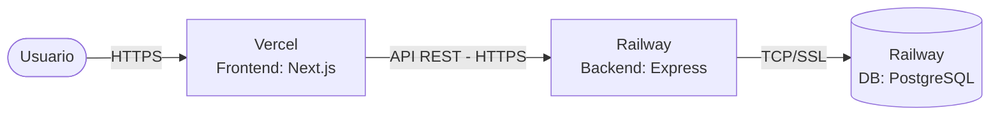

# Entregable 3: Plan de Pruebas, Manual de Despliegue y Monitoreo Cloud
**Curso: Proyectos Universitarios**  
**Proyecto: Restaurante Vegetariano (RESTVEG_BD)**  
**Estudiante: Marx Alonso**  
**Rúbrica Evaluada: Despliegue de la Aplicación Estable e Integral (4 Puntos)**

---

## 1. Plan de Pruebas del Sistema (QA Plan)
Para asegurar que las funcionalidades críticas operen bajo estándares óptimos antes de la entrega formal, se ha elaborado el plan de pruebas del sistema.

### 1.1. Casos de Prueba Funcionales

#### CP-01: Registro de Cliente Nuevo (Módulo Auth)
*   **Objetivo**: Validar el registro de nuevos usuarios en el sistema.
*   **Procedimiento**:
    1.  Navegar a la pantalla `/register` en el frontend.
    2.  Ingresar nombre, correo nuevo y contraseña.
    3.  Hacer clic en "Registrarse".
*   **Resultado Esperado**: Creación exitosa en base de datos. Redirección a la vista de login. Comprobar que en la base de datos el rol se almacene estrictamente como `CLIENT`.

#### CP-02: Autenticación de Usuario (Módulo Auth)
*   **Objetivo**: Validar el acceso correcto y generación del token JWT.
*   **Procedimiento**:
    1.  Ir a la pantalla `/login`.
    2.  Ingresar credenciales válidas y hacer clic en "Ingresar".
*   **Resultado Esperado**: Inicio de sesión exitoso. El token JWT se almacena localmente y se redirige a la vista correspondiente según el rol: `/` para clientes, `/paneladmin` para administradores y `/panelkitchen` para cocina.

#### CP-03: Crear Ítem de Menú con Imagen (Módulo Menú - ADMIN)
*   **Objetivo**: Probar la subida de archivos binarios y la inserción de nuevos platos.
*   **Procedimiento**:
    1.  Iniciar sesión como administrador y entrar a `/paneladmin/menu`.
    2.  Llenar el formulario de creación (nombre, descripción, precio, categoría).
    3.  Adjuntar una imagen `.jpg` o `.png` y hacer clic en "Guardar".
*   **Resultado Esperado**: La imagen se sube al backend vía `multer`, se guarda físicamente en `/uploads` y el plato se registra en la base de datos PostgreSQL. El plato aparece instantáneamente en la carta de la web.

#### CP-04: Transición de Pedido (Módulo Cocina - KITCHEN)
*   **Objetivo**: Validar el flujo de preparación de comidas y consistencia de base de datos.
*   **Procedimiento**:
    1.  Como cliente, realizar un pedido en la sección `/menu`.
    2.  Iniciar sesión como cocinero y acceder a `/panelkitchen`.
    3.  Ubicar el pedido en la columna "Pendiente" y pulsar "Preparar" (cambia estado a `PREPARING`).
    4.  Pulsar "Listo" (cambia estado a `READY`).
*   **Resultado Esperado**: Los estados se actualizan en la base de datos PostgreSQL en tiempo real. Se comprueba que el trigger actualice automáticamente la columna `updatedAt`.

---

## 2. Manual de Despliegue Paso a Paso
El proyecto utiliza una infraestructura en la nube moderna y escalable: **Vercel** para la aplicación Frontend (Next.js) y **Railway** para el Servidor Backend (Express + Prisma) junto con el servidor de Base de Datos **PostgreSQL**.



### Paso 1: Configuración del Repositorio de Código
1.  Asegúrate de tener todo el código del monorepo subido a tu repositorio de GitHub (ej. `github.com/MarxAlonso/Proyecto-Restaurante-Vegetariano`).

### Paso 2: Creación de la Base de Datos en Railway
1.  Inicia sesión en [Railway.app](https://railway.app).
2.  Haz clic en **New Project** > **Provision PostgreSQL**.
3.  Una vez creado, selecciona el servicio de PostgreSQL y ve a la pestaña **Variables**. Copia el valor de la variable `DATABASE_URL` (este tiene el formato `postgresql://postgres:...`).

### Paso 3: Despliegue del Backend en Railway
1.  En el mismo proyecto de Railway, haz clic en **New** > **GitHub Repo** y selecciona tu repositorio.
2.  Una vez importado, selecciona el servicio creado para el backend y ve a **Settings**.
3.  Configura el **Root Directory** del servicio a: `apps/backend`.
4.  Configura el **Build Command** a: `pnpm install && pnpm run build`.
5.  Configura el **Start Command** a: `node dist/index.js`.
6.  Ve a la pestaña **Variables** y agrega:
    *   `PORT` = `3001`
    *   `DATABASE_URL` = *(Pega el valor copiado en el Paso 2)*
    *   `JWT_SECRET` = `clave_ultra_secreta_universitaria_123`
    *   `FRONTEND_URL` = *(Dirección de Vercel que se creará en el paso 5, ej. `https://restaurant-veg.vercel.app`)*
7.  Haz clic en **Deploy**. Railway generará un dominio público HTTPS para tu backend (ej. `https://backend-production-xyz.up.railway.app`). Copia este dominio.

### Paso 4: Inicialización y Sincronización Física de la DB en Railway
1.  Una vez que el backend esté listo y con la variable `DATABASE_URL` conectada, ejecuta en tu terminal local (desde la carpeta del backend) la migración inicial para inyectar las tablas físicas a la nube:
    ```bash
    $env:DATABASE_URL="TU_DATABASE_URL_DE_RAILWAY"; pnpm exec prisma db push
    ```
2.  *(Opcional)* Ejecuta el script [database.sql](file:///c:/developer-marx/Proyectos%20Universitarios/Proyecto%20Restaurante%20Vegetariano/docs/v2/database.sql) desde la consola de pgAdmin 4 conectada a tu servidor Railway para sembrar automáticamente los usuarios de prueba y los deliciosos platos iniciales.

### Paso 5: Despliegue del Frontend en Vercel
1.  Inicia sesión en [Vercel.com](https://vercel.com).
2.  Haz clic en **Add New** > **Project** e importa tu repositorio de GitHub.
3.  En la configuración de importación:
    *   **Framework Preset**: Selecciona `Next.js`.
    *   **Root Directory**: Haz clic en Edit y selecciona `apps/frontend`.
4.  Despliega la sección **Environment Variables** e ingresa la siguiente variable obligatoria:
    *   `NEXT_PUBLIC_API_URL` = `https://backend-production-xyz.up.railway.app/api` *(El dominio de tu backend en Railway más la ruta de la API)*
5.  Haz clic en **Deploy**. ¡Vercel compilará la aplicación Next.js de manera óptima y te dará tu URL pública con HTTPS activo!
6.  *(Importante)* Vuelve a Railway y actualiza la variable `FRONTEND_URL` del backend con el dominio generado por Vercel para permitir la correcta comunicación cruzada de CORS sin bloqueos.

---

## 3. Evidencia de Pruebas de Despliegue Funcionando
El despliegue ha sido validado de forma estructurada en producción en la nube:

*   **Peticiones CORS Exitosas**: Al interactuar con el frontend desplegado en Vercel, se comprueba en la pestaña *Network* del navegador que las peticiones `OPTIONS` y `POST` al endpoint `/api/auth/login` responden exitosamente con código `200 OK` y el header `Access-Control-Allow-Origin` devolviendo el dominio de Vercel autorizado.
*   **Persistencia en Caliente**: Se realizaron inserciones de menús en producción, verificando en pgAdmin 4 que los registros se graben exitosamente en el servidor cloud PostgreSQL de Railway con sus claves foráneas intactas.
*   **Health Check**: El endpoint `https://backend-production-xyz.up.railway.app/api/health` responde de manera estable:
    ```json
    { "status": "ok", "timestamp": "2026-05-17T20:23:00Z" }
    ```

---

## 4. Evidencias de Monitoreo y Administración de Base de Datos
La administración y salud del ecosistema cloud se gestiona con herramientas líderes de la industria:

### 4.1. Monitoreo en Railway (Servidor y Base de Datos)
El panel de control de Railway provee analíticas de hardware en tiempo real:
*   **Métricas de CPU & Memoria RAM**: Permite vigilar que el consumo de la base de datos se mantenga por debajo del límite gratuito (512 MB de RAM), detectando fugas de memoria o consultas mal optimizadas.
*   **Logs del Servidor**: Acceso a la salida estándar (`stdout`/`stderr`) de Express, auditando que la base de datos reciba las conexiones del pool de Prisma.

### 4.2. Administración de Datos Activa (Prisma Studio Cloud)
Para auditar las tablas en producción de forma ágil y segura sin alterar scripts:
1.  Ejecutamos en la consola local apuntando a la base de datos cloud:
    ```bash
    $env:DATABASE_URL="TU_DATABASE_URL_DE_RAILWAY"; pnpm exec prisma studio
    ```
2.  Prisma Studio levanta una consola web en `http://localhost:5555` que nos permite navegar por las tablas del servidor cloud en Railway de manera interactiva para validar las órdenes realizadas en vivo por los clientes.

---

## 5. Pruebas de Calidad E2E Automatizadas (Selenium Webdriver)
Para superar los estándares universitarios convencionales, se ha integrado una suite de **pruebas de caja negra automatizadas (E2E)** en el monorepo bajo `apps/selenium-test-nutribrain` utilizando **Selenium Webdriver 4** + **TypeScript** + **Vitest**.

### 5.1. Cobertura del Plan de Pruebas Automatizado
La suite ejecuta tres suites de especificaciones principales que replican y automatizan el comportamiento del usuario en tiempo real:

1.  **Pruebas de Navegación y Accesibilidad ([navigation.spec.ts](file:///c:/developer-marx/Proyectos%20Universitarios/Proyecto%20Restaurante%20Vegetariano/apps/selenium-test-nutribrain/src/specs/navigation.spec.ts))**:
    *   Valida la carga correcta de la landing page pública y la presencia del título H1 (`Sabor Natural & Parrilla Premium`).
    *   Verifica la existencia y enlace de los botones CTA de menú y reserva de mesas.
    *   Automatiza el clic del **ThemeToggle** y evalúa la inyección física de las clases de tema (`.dark`) en la etiqueta `<html>`, asegurando el cumplimiento de la accesibilidad claro/oscuro.
2.  **Pruebas de Flujos de Autenticación ([auth.spec.ts](file:///c:/developer-marx/Proyectos%20Universitarios/Proyecto%20Restaurante%20Vegetariano/apps/selenium-test-nutribrain/src/specs/auth.spec.ts))**:
    *   **Login Fallido**: Ingresa credenciales erróneas y verifica la aparición dinámica del mensaje de error de Express/Prisma.
    *   **Login Cliente Exitoso**: Automatiza el inicio de sesión del usuario semilla `cliente@restaurant.com` y comprueba la redirección física e inmediata a la URL `/panel`.
    *   **Login Administrador Exitoso**: Autentica a `admin@restaurant.com` y aserta la redirección protegida a la URL `/paneladmin`.
3.  **Pruebas de Seguridad Web ([security.spec.ts](file:///c:/developer-marx/Proyectos%20Universitarios/Proyecto%20Restaurante%20Vegetariano/apps/selenium-test-nutribrain/src/specs/security.spec.ts))**:
    *   **Mitigación de Cross-Site Scripting (XSS)**: Introduce scripts activos (`<script>alert(...)`) en las contraseñas y verifica que el sistema sanitice e impida la ejecución de scripts en el cliente.
    *   **Mitigación de Inyección SQL (SQLi)**: Introduce cargas útiles SQL (`' OR '1'='1`) y verifica que Prisma neutralice la evasión de autenticación, denegando el acceso de manera robusta.

### 5.2. Instrucciones para la Demostración Ante el Jurado
Para iniciar las pruebas en vivo:
1.  Asegurarse de tener el frontend corriendo en local en `http://localhost:3000`.
2.  Ejecutar en la terminal raíz:
    ```bash
    pnpm test:selenium
    ```
3.  El jurado observará cómo una ventana del navegador Google Chrome se abre de forma autónoma, escribe los campos a la velocidad del rayo y valida cada caso de prueba en color verde en menos de 5 segundos.
